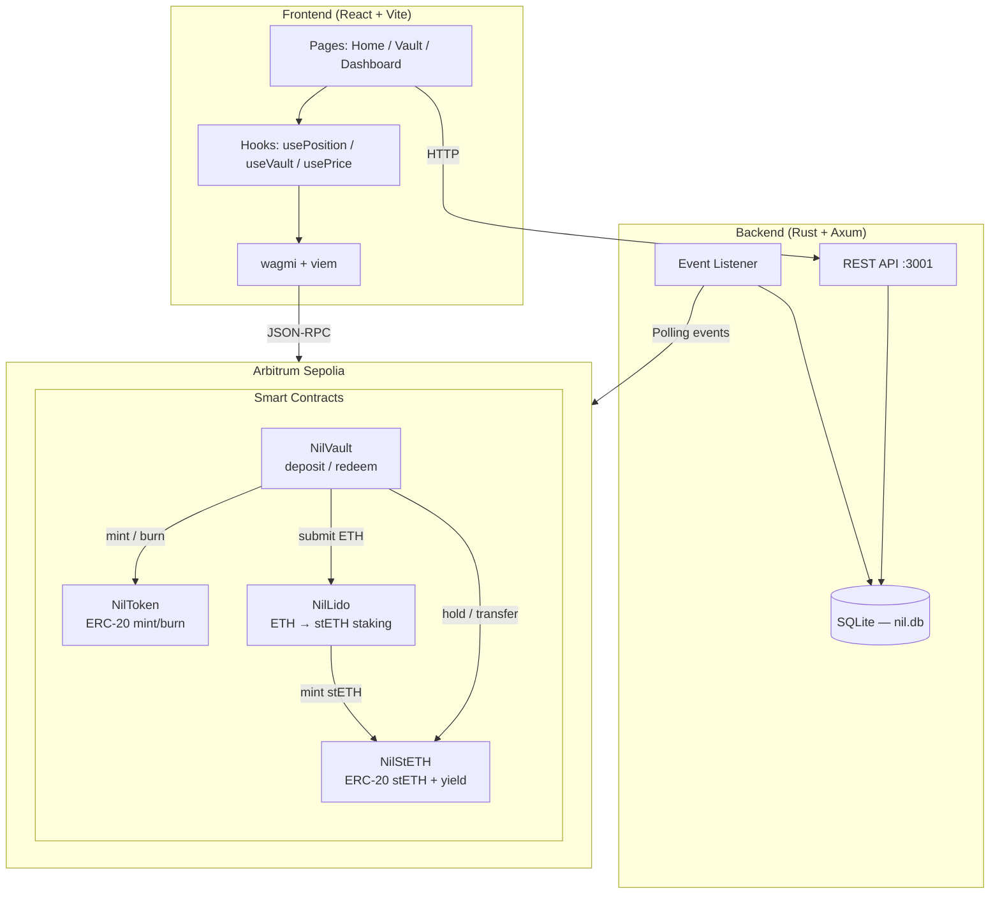
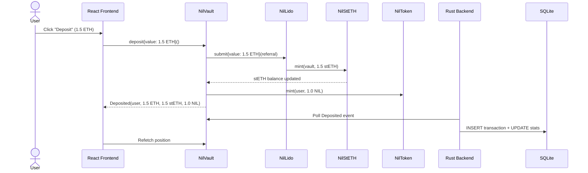
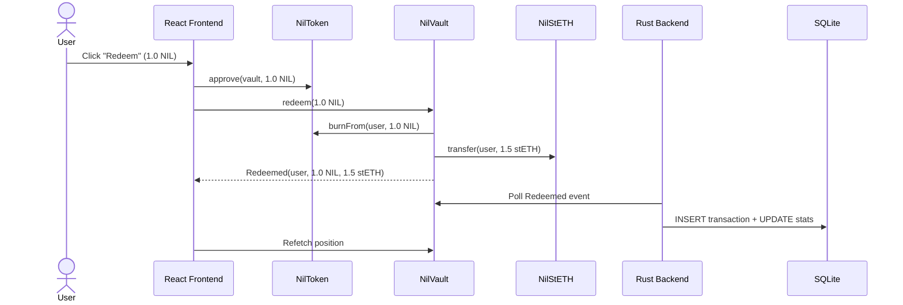
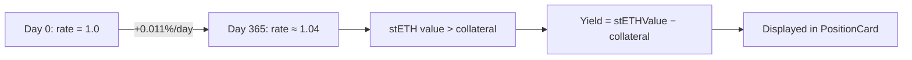
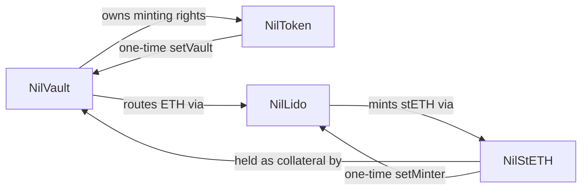

# Nil Protocol — Architecture Diagram

## System Overview

```mermaid
graph TB
    subgraph Client["Frontend (React + Vite)"]
        UI[Pages: Home / Vault / Dashboard]
        Hooks[Hooks: usePosition / useVault / usePrice]
        Wagmi[wagmi + viem]
    end

    subgraph Backend["Backend (Rust + Axum)"]
        API[REST API :3001]
        Listener[Event Listener]
        DB[(SQLite — nil.db)]
    end

    subgraph Chain["Arbitrum Sepolia"]
        subgraph Contracts["Smart Contracts"]
            NilVault[NilVault<br/>deposit / redeem]
            NilToken[NilToken<br/>ERC-20 mint/burn]
            NilLido[NilLido<br/>ETH → stETH staking]
            NilStETH[NilStETH<br/>ERC-20 stETH + yield]
        end
    end

    UI --> Hooks
    Hooks --> Wagmi
    Wagmi -->|JSON-RPC| Chain
    UI -->|HTTP| API
    API --> DB
    Listener -->|Polling events| Chain
    Listener --> DB

    NilVault -->|mint / burn| NilToken
    NilVault -->|submit ETH| NilLido
    NilLido -->|mint stETH| NilStETH
    NilVault -->|hold / transfer| NilStETH
```

## Deposit Flow

```mermaid
sequenceDiagram
    actor User
    participant UI as React Frontend
    participant Vault as NilVault
    participant Lido as NilLido
    participant StETH as NilStETH
    participant Token as NilToken
    participant Backend as Rust Backend
    participant DB as SQLite

    User->>UI: Click "Deposit" (1.5 ETH)
    UI->>Vault: deposit{value: 1.5 ETH}()
    Vault->>Lido: submit{value: 1.5 ETH}(referral)
    Lido->>StETH: mint(vault, 1.5 stETH)
    StETH-->>Vault: stETH balance updated
    Vault->>Token: mint(user, 1.0 NIL)
    Vault-->>UI: Deposited(user, 1.5 ETH, 1.5 stETH, 1.0 NIL)
    Backend->>Vault: Poll Deposited event
    Backend->>DB: INSERT transaction + UPDATE stats
    UI->>Vault: Refetch position
```

## Redeem Flow

```mermaid
sequenceDiagram
    actor User
    participant UI as React Frontend
    participant Token as NilToken
    participant Vault as NilVault
    participant StETH as NilStETH
    participant Backend as Rust Backend
    participant DB as SQLite

    User->>UI: Click "Redeem" (1.0 NIL)
    UI->>Token: approve(vault, 1.0 NIL)
    UI->>Vault: redeem(1.0 NIL)
    Vault->>Token: burnFrom(user, 1.0 NIL)
    Vault->>StETH: transfer(user, 1.5 stETH)
    Vault-->>UI: Redeemed(user, 1.0 NIL, 1.5 stETH)
    Backend->>Vault: Poll Redeemed event
    Backend->>DB: INSERT transaction + UPDATE stats
    UI->>Vault: Refetch position
```

## Yield Accrual

```mermaid
graph LR
    A[Day 0: rate = 1.0] -->|+0.011%/day| B[Day 365: rate ≈ 1.04]
    B --> C[stETH value > collateral]
    C --> D[Yield = stETHValue − collateral]
    D --> E[Displayed in PositionCard]
```

## Contract Relationships

```mermaid
graph LR
    NilVault -->|owns minting rights| NilToken
    NilVault -->|routes ETH via| NilLido
    NilLido -->|mints stETH via| NilStETH
    NilStETH -->|held as collateral by| NilVault
    NilToken -->|one-time setVault| NilVault
    NilStETH -->|one-time setMinter| NilLido
```
